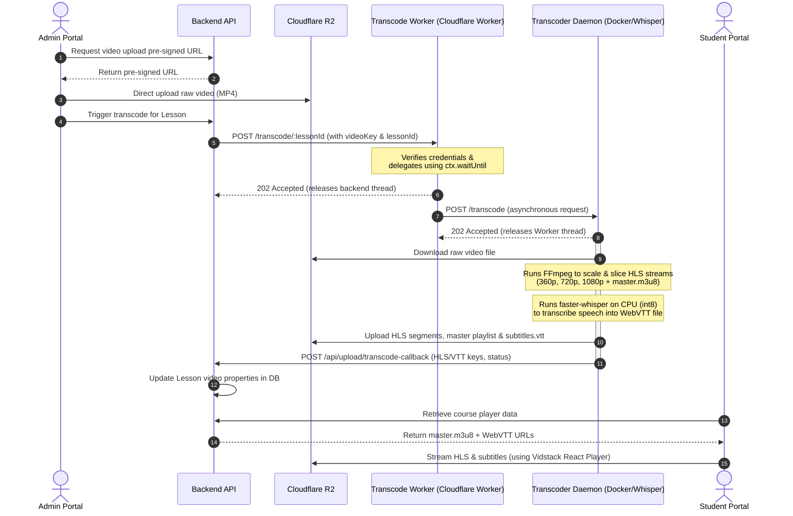

# 🎥 VeoLMS

[](https://opensource.org/licenses/ISC)
[](https://nextjs.org/)
[](https://expressjs.com/)
[](https://nodejs.org/)
[](https://www.mongodb.com/)
[](https://www.cloudflare.com/products/r2/)

VeoLMS is a modern, high-performance, open-source Learning Management System (LMS) designed for video-first learning. It features adaptive HTTP Live Streaming (HLS) playback, secure content delivery, integrated payment processing, and automated, AI-powered speech-to-text subtitle generation.

---

## 🌟 Key Features

- 💎 **Premium Vercel-Inspired Aesthetic**: High-contrast, clean developer-brand theme built using [Next.js 16](file:///C:/Users/LENOVO/projects/veolms/frontend/package.json), Tailwind CSS v4, and Lucide React.
- 🎬 **Multi-Bitrate HLS Streaming**: Compresses raw videos into multi-quality HLS streams (360p, 720p, 1080p + `master.m3u8`) to guarantee zero-buffering playback across desktop and mobile devices.
- 🎙️ **AI Autogenerated Subtitles**: Uses a local Hugging Face `faster-whisper` AI model to transcribe dialogue and output production-ready WebVTT (`.vtt`) subtitles on the fly.
- 💳 **Razorpay Checkout**: Seamless payment workflows for purchasing course enrollments.
- ☁️ **Cloudflare R2 Storage**: Low-cost, zero-egress cost object storage for original videos, transcoded HLS segments, thumbnails, and subtitles.
- ⚡ **Async Processing Pipeline**: A Cloudflare Worker coordinates processing, offloading long-running FFmpeg and Whisper ML workloads asynchronously to a background transcoder daemon.

---

## 📐 Architecture & Video Processing Flow

The core highlight of VeoLMS is its serverless-backed asynchronous video transcoding and transcription pipeline:



---

## 📂 Module Breakdown

VeoLMS is organized into four main directories:

1. 🌐 **`frontend`** ([frontend/](file:///C:/Users/LENOVO/projects/veolms/frontend))
   - A Next.js project styled with Tailwind CSS v4 based on the [DESIGN.md](file:///C:/Users/LENOVO/projects/veolms/frontend/DESIGN.md) specification.
   - Embeds the [Vidstack player](https://vidstack.io/docs/player) under `components/` for smooth HLS rendering and responsive caption styling.
2. 🖧 **`backend`** ([backend/](file:///C:/Users/LENOVO/projects/veolms/backend))
   - Express server in TypeScript using MongoDB/Mongoose.
   - Controls course management, user session JWT authentication, payment webhooks, and pre-signed R2 upload signatures.
3. ☁️ **`transcode-worker`** ([transcode-worker/](file:///C:/Users/LENOVO/projects/veolms/transcode-worker))
   - A Cloudflare Worker which acts as a lightweight proxy using `ctx.waitUntil` to asynchronously call the transcode daemon without holding HTTP connections.
4. 🐳 **`transcoder-daemon`** ([transcoder-daemon/](file:///C:/Users/LENOVO/projects/veolms/transcoder-daemon))
   - A Node.js daemon and Python Whisper script packaged in a custom Dockerfile.
   - Transcodes raw MP4 videos using FFmpeg and automatically transcribes speech using Hugging Face's `faster-whisper` ML model.

---

## 🛠️ Prerequisites & Setup

### 1. Cloudflare R2 Configuration
- Create a bucket on Cloudflare R2 (e.g., `veolms-videos`).
- Enable **Public Access** or connect a **Custom Domain** to the bucket to serve playlists/videos.
- Configure CORS rules on your R2 bucket:
  ```json
  [
    {
      "AllowedOrigins": ["http://localhost:3000", "https://yourfrontend.com"],
      "AllowedMethods": ["GET", "PUT", "POST", "DELETE", "HEAD"],
      "AllowedHeaders": ["*"],
      "ExposeHeaders": ["ETag"],
      "MaxAgeSeconds": 3000
    }
  ]
  ```

### 2. Razorpay Integration
- Create a Razorpay developer account.
- Obtain your `Key ID` and `Key Secret` from the dashboard settings.
- Configure a webhook pointing to `${BACKEND_URL}/api/payments/webhook` listening for `payment.authorized` or `order.paid` events.

---

## 🚀 Installation & Running Locally

### Backend Setup

1. Navigate to the backend directory:
   ```bash
   cd backend
   ```
2. Copy and configure the environment variables:
   ```bash
   cp .env.example .env
   ```
   Ensure you replace placeholders with your actual **MongoDB connection string**, **Cloudflare R2 API keys**, and **Razorpay credentials**.
3. Install dependencies:
   ```bash
   npm install
   ```
4. Seed the default database users:
   ```bash
   npm run seed
   ```
   *This seeds two default accounts in your MongoDB database:*
   - **Admin**: `admin@veolms.com` / `Admin@123`
   - **Student**: `student@veolms.com` / `Student@123`
5. Run the server in development mode:
   ```bash
   npm run dev
   ```
   The backend API will boot up on `http://localhost:5000`.

### Frontend Setup

1. Navigate to the frontend directory:
   ```bash
   cd ../frontend
   ```
2. Set up local variables (Create `.env.local` if not present):
   ```env
   NEXT_PUBLIC_API_URL=http://localhost:5000
   ```
3. Install dependencies:
   ```bash
   npm install
   ```
4. Start the Next.js development server:
   ```bash
   npm run dev
   ```
   Open [http://localhost:3000](http://localhost:3000) in your web browser to explore.

### Cloudflare Worker Setup

1. Navigate to the transcode-worker directory:
   ```bash
   cd ../transcode-worker
   ```
2. Open [wrangler.toml](file:///C:/Users/LENOVO/projects/veolms/transcode-worker/wrangler.toml) and update:
   - `VPS_DAEMON_URL`: URL of your deployed transcoder daemon (e.g. Hugging Face Space URL).
   - `DAEMON_SECRET`: Shared secret code key.
   - `BACKEND_URL`: URL of your backend API.
   - `WORKER_SECRET`: Shared secret code key matching your backend's `.env`.
3. Login and deploy to Cloudflare:
   ```bash
   npx wrangler login
   npx wrangler deploy
   ```

### Transcoder Daemon Setup (Local Test)

For local development, you need `ffmpeg` and `python3` (with `faster-whisper`) installed on your local machine.

1. Navigate to the transcoder-daemon directory:
   ```bash
   cd ../transcoder-daemon
   ```
2. Install Node dependencies:
   ```bash
   npm install
   ```
3. Create a python virtual environment, activate it, and install `faster-whisper`:
   ```bash
   python3 -m venv venv
   # On Windows:
   .\venv\Scripts\activate
   # On macOS/Linux:
   source venv/bin/activate

   pip install faster-whisper
   ```
4. Create a `.env` file containing:
   ```env
   PORT=7860
   DAEMON_SECRET=your-very-secure-daemon-secret
   R2_ACCOUNT_ID=your_cloudflare_account_id
   R2_ACCESS_KEY_ID=your_r2_access_key
   R2_SECRET_ACCESS_KEY=your_r2_secret_key
   R2_BUCKET_NAME=veolms-videos
   ```
5. Run the daemon locally:
   ```bash
   node daemon.js
   ```

---

## 🚢 Production Deployment

### 🐳 Transcoder Daemon (Hugging Face Spaces / Render)

Hugging Face Spaces allows you to host Docker files for free.

1. Create a new Space on [Hugging Face](https://huggingface.co/new-space).
2. Choose **Docker** as the SDK.
3. Push the contents of the `transcoder-daemon` directory into the Space repository.
4. Set the following secrets in the Space's **Settings -> Variables and secrets**:
   - `PORT`: `7860`
   - `DAEMON_SECRET`: A secure random password shared with the Cloudflare Worker.
   - `R2_ACCOUNT_ID`: Your Cloudflare Account ID.
   - `R2_ACCESS_KEY_ID`: Your Cloudflare Access Key.
   - `R2_SECRET_ACCESS_KEY`: Your Cloudflare Secret Key.
   - `R2_BUCKET_NAME`: Your target R2 bucket name.

### 🌐 Backend & Frontend

- **Backend**: Can be hosted on Render, Railway, or AWS Elastic Beanstalk. Ensure `trust proxy` is configured properly.
- **Frontend**: Can be hosted on Vercel or Netlify. Add `NEXT_PUBLIC_API_URL` pointing to your deployed backend API.
