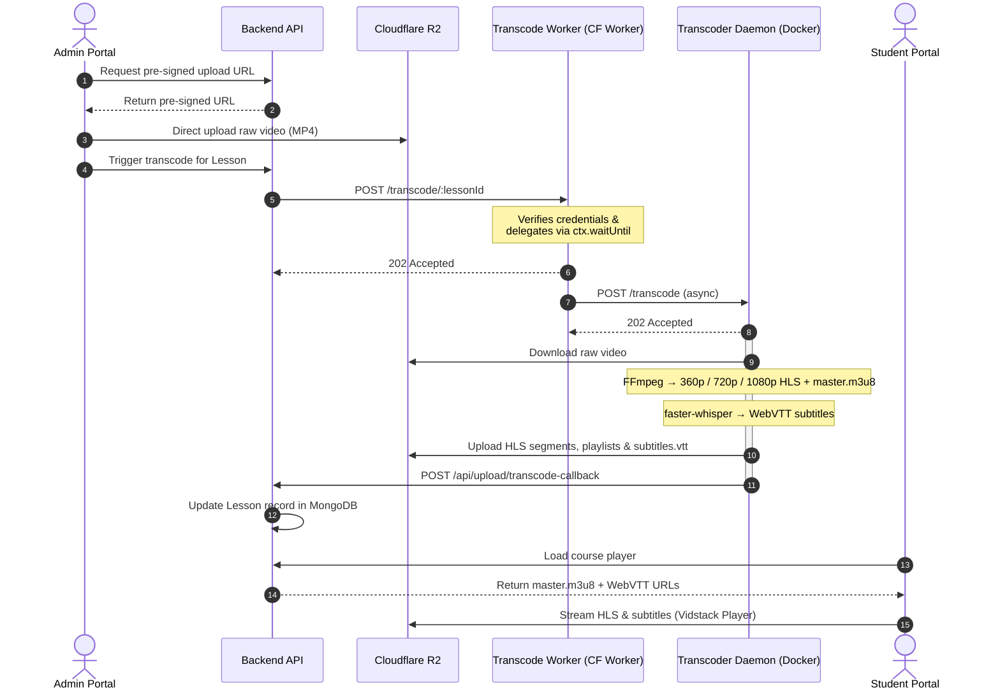

# 🎥 VeoLMS

[](https://opensource.org/licenses/ISC)
[](https://nextjs.org/)
[](https://expressjs.com/)
[](https://nodejs.org/)
[](https://www.mongodb.com/)
[](https://www.cloudflare.com/products/r2/)
[](https://ai.google.dev/)

VeoLMS is a modern, high-performance, open-source **Learning Management System (LMS)** built for video-first education. It combines adaptive HLS streaming, AI-powered learning tools, automated subtitle generation, certificate issuance, and Razorpay payment processing — all wrapped in a sleek Vercel-inspired UI.

---

## 🌟 Key Features

| Feature | Description |
|---|---|
| 🎬 **Multi-Bitrate HLS Streaming** | Transcodes raw videos to 360p / 720p / 1080p HLS streams with a `master.m3u8` playlist for smooth, adaptive playback |
| 🎙️ **AI Subtitle Generation** | Automatically transcribes dialogue with Hugging Face `faster-whisper` and outputs production-ready WebVTT (`.vtt`) subtitles |
| 🤖 **AI Course Chat** | Per-course AI assistant powered by **Google Gemini** with persistent conversation history |
| 🏆 **Certificate System** | Auto-generates and issues downloadable completion certificates when a student finishes a course |
| 📝 **Student Notes** | Rich per-lesson note-taking tied to specific video timestamps |
| ⭐ **Course Reviews** | Students can submit ratings and reviews; aggregated per-course rating is surfaced on the course page |
| 🎟️ **Coupon / Discount System** | Admins can create percentage or flat-amount discount coupons with usage limits and expiry dates |
| 📊 **Progress Tracking** | Granular per-lesson completion tracking with overall course-level progress percentage |
| 💳 **Razorpay Checkout** | Seamless enrollment payment workflows with webhook-verified order confirmation |
| ☁️ **Cloudflare R2 Storage** | Zero-egress-cost object storage for videos, HLS segments, thumbnails, subtitles, and certificates |
| ⚡ **Async Processing Pipeline** | Cloudflare Worker + background daemon architecture keeps API threads free during long FFmpeg / Whisper jobs |
| 📖 **Swagger API Docs** | Interactive API documentation available at `/api/docs` in development |
| 🛡️ **Security Hardened** | Helmet, CORS, rate limiting, JWT + cookie refresh tokens, stateful session verification, dynamic student watermarking, tab-blur prevention, print-screen blocking |

---

## 📐 Architecture & Video Processing Flow



---

## 📂 Project Structure

```
veolms/
├── backend/            # Express + TypeScript REST API
├── frontend/           # Next.js 16 + React 19 + Tailwind CSS v4
├── transcode-worker/   # Cloudflare Worker (async proxy)
├── transcoder-daemon/  # Node.js + Python FFmpeg/Whisper daemon
└── docs/               # Architecture & design documentation
```

### Module Breakdown

#### 🌐 `frontend/`
- **Next.js 16** app with **Tailwind CSS v4** and a Vercel-inspired black-and-white design theme.
- **Vidstack React Player** for adaptive HLS playback with WebVTT caption support.
- Pages: Home, Course Catalog, Course Detail, Video Player (`/learn`), Student Dashboard, Admin Panel, Certificates, Login / Signup.
- **Admin Panel** covers: Course CRUD, Lesson management, Video upload & transcoding, Student overview, Enrollment management, Coupon management.

#### 🖧 `backend/`
- **Express + TypeScript** server on `http://localhost:5000`.
- **MongoDB / Mongoose** for all data persistence.
- REST API routes:

| Route Prefix | Responsibility |
|---|---|
| `/api/auth` | Register, login, logout, session management |
| `/api/courses` | Course CRUD, reviews, listing & search |
| `/api/lessons` | Lesson CRUD, video metadata |
| `/api/upload` | Pre-signed R2 URLs, transcode trigger, callback |
| `/api/payments` | Razorpay order creation & webhook |
| `/api/enrollments` | Enroll / unenroll, enrollment lookup |
| `/api/progress` | Mark lessons complete, fetch progress % |
| `/api/admin` | Admin-only management endpoints |
| `/api/ai-chats` | Gemini-powered course AI chat |
| `/api/notes` | Student lesson notes (CRUD) |
| `/api/reviews` | Course reviews & ratings |
| `/api/certificates` | Certificate generation & retrieval |
| `/api/docs` | Swagger UI (development only) |

#### ☁️ `transcode-worker/`
- Cloudflare Worker acting as a lightweight async proxy.
- Uses `ctx.waitUntil` to call the transcoder daemon without blocking the HTTP response.
- Verifies shared secrets before delegating work.

#### 🐳 `transcoder-daemon/`
- Node.js Express daemon + Python `faster-whisper` script packaged in a **Docker** container.
- Pulls raw MP4 from R2 → runs FFmpeg to produce multi-quality HLS → runs Whisper to produce WebVTT → uploads everything back to R2 → POSTs callback to the backend.

---

## 🛠️ Prerequisites

- **Node.js** v18+
- **npm** v9+
- **MongoDB** (local or Atlas connection string)
- **Cloudflare R2** bucket (recommended to disable public access/read on the bucket since video streams and subtitles are securely proxied and authenticated via the backend; only a public URL is used for public assets like thumbnails)
- **Razorpay** account (Key ID + Secret + webhook)
- **Google Gemini API key** (for AI chat)
- **Python 3.10+** + `faster-whisper` (for local daemon)
- **FFmpeg** installed and on `PATH` (for local daemon)

---

## 🚀 Installation & Local Setup

### 1. Backend

```bash
cd backend
cp .env.example .env
# Fill in MongoDB URI, Cloudflare R2 keys, Razorpay keys, Gemini API key, etc.
npm install
npm run seed          # Seeds admin@veolms.com / Admin@123  &  student@veolms.com / Student@123
npm run dev           # Starts on http://localhost:5000
```

> **Swagger UI** is available at [http://localhost:5000/api/docs](http://localhost:5000/api/docs) when running in development mode.

### 2. Frontend

```bash
cd frontend
# Create .env.local if it doesn't exist
echo "NEXT_PUBLIC_API_URL=http://localhost:5000" > .env.local
npm install
npm run dev           # Starts on http://localhost:3000
```

### 3. Cloudflare Worker

```bash
cd transcode-worker
# Edit wrangler.toml — set VPS_DAEMON_URL, DAEMON_SECRET, BACKEND_URL, WORKER_SECRET
npx wrangler login
npx wrangler deploy
```

### 4. Transcoder Daemon (Local)

Requires `ffmpeg` on `PATH` and Python 3.10+ with `faster-whisper`.

```bash
cd transcoder-daemon

# Node dependencies
npm install

# Python virtual environment
python3 -m venv venv
# Windows:
.\\venv\\Scripts\\activate
# macOS/Linux:
source venv/bin/activate

pip install faster-whisper

# Create .env
cat > .env <<EOF
PORT=7860
DAEMON_SECRET=your-daemon-secret
R2_ACCOUNT_ID=your_cloudflare_account_id
R2_ACCESS_KEY_ID=your_r2_access_key
R2_SECRET_ACCESS_KEY=your_r2_secret_key
R2_BUCKET_NAME=veolms-videos
EOF

node daemon.js
```

---

## ⚙️ Environment Variables

### Backend (`.env`)

| Variable | Description |
|---|---|
| `PORT` | Server port (default: `5000`) |
| `NODE_ENV` | `development` or `production` |
| `MONGO_URI` | MongoDB connection string |
| `JWT_SECRET` | Secret for signing JWTs |
| `FRONTEND_URL` | Allowed CORS origin (e.g. `http://localhost:3000`) |
| `CLOUDFLARE_ACCOUNT_ID` | Cloudflare account ID |
| `R2_ACCESS_KEY_ID` | R2 access key |
| `R2_SECRET_ACCESS_KEY` | R2 secret key |
| `R2_BUCKET_NAME` | R2 bucket name |
| `R2_PUBLIC_URL` | Public URL prefix for the R2 bucket |
| `RAZORPAY_KEY_ID` | Razorpay Key ID |
| `RAZORPAY_KEY_SECRET` | Razorpay Key Secret |
| `RAZORPAY_WEBHOOK_SECRET` | Razorpay webhook signature secret |
| `GEMINI_API_KEY` | Google Gemini API key (for AI chat) |
| `TRANSCODE_WORKER_URL` | Deployed Cloudflare Worker URL |
| `WORKER_SECRET` | Shared secret with the Cloudflare Worker |

### Frontend (`.env.local`)

| Variable | Description |
|---|---|
| `NEXT_PUBLIC_API_URL` | Backend base URL (e.g. `http://localhost:5000`) |

---

## 🛡️ Security Architecture & DRM Deterrents

VeoLMS implements a robust, multi-layer security configuration to protect course resources and user sessions:

### 1. Token Lifecycle & Session Management
* **Dual-Token System**: Access tokens expire in **15 minutes** to limit exposure if stolen. Refresh tokens expire in **7 days** and are sent via secure, HTTP-only cross-origin cookies.
* **Stateful Session Revocation**: Access and refresh tokens are cryptographically checked against the database (`Session` model) on each request. When a user logs out or terminates a session from another device, authorization is revoked immediately.
* **MongoDB Session TTL**: Sessions in the database automatically expire 7 days after their `lastActive` timestamp via a MongoDB TTL index, preventing database bloat.
* **Concurrent Device Limits**: Users are limited to **2 active concurrent sessions** to prevent account sharing.

### 2. Video Streaming & Asset Protection
* **Authenticated Backend Proxying**: The browser never gets direct access to video files (`.mp4`), HLS indexes (`.m3u8`), or HLS segments (`.ts`) on Cloudflare R2. Instead, all streams are securely requested using AWS SDK credentials by the server and piped to authorized clients. Public access on the R2 bucket can be completely disabled.
* **Enrollment Checking**: The video stream proxy endpoints verify that the student is authenticated and enrolled in the requested course before serving any segments.

### 3. Client-Side Screen Recording Deterrents
* **Dynamic Student Email Watermark**: A semi-transparent floating text block displaying the student's email and ID bounces randomly inside the media player container every 7 seconds. 
* **Static Anti-Crop Watermark**: A secondary stationary watermark is kept at the bottom-right of the player to deter video cropping attempts.
* **Tab-Focus Interception**: The video player monitors window focus. If the tab loses focus (e.g. user opens a screen-recording software window), the video automatically pauses and displays a blurred blackout shield.
* **Print/Screenshot Blocking**: Custom print media CSS rules hide the video player if a print-screen or browser printing command is issued.
* **Context Menu Lock**: Right-click is blocked inside the video player wrapper to prevent inspect-element link grabbing.

---

## 🧪 Testing

The backend includes an integration test suite using **Jest** + **Supertest** + **mongodb-memory-server**.

```bash
cd backend
npm test
```

---

## 🚢 Production Deployment

### 🐳 Transcoder Daemon — Hugging Face Spaces (Free Docker Hosting)

1. Create a new Space at [huggingface.co/new-space](https://huggingface.co/new-space) and choose **Docker** as the SDK.
2. Push the `transcoder-daemon/` directory into the Space repository.
3. Set the following secrets under **Settings → Variables and secrets**:

| Secret | Value |
|---|---|
| `PORT` | `7860` |
| `DAEMON_SECRET` | Secure random string (match Cloudflare Worker) |
| `R2_ACCOUNT_ID` | Cloudflare Account ID |
| `R2_ACCESS_KEY_ID` | R2 Access Key |
| `R2_SECRET_ACCESS_KEY` | R2 Secret Key |
| `R2_BUCKET_NAME` | Your R2 bucket name |

### 🌐 Backend

Host on **Render**, **Railway**, or **AWS Elastic Beanstalk**.
- Ensure `trust proxy` is set (already configured).
- Set all environment variables from the table above.

### 🖥️ Frontend

Deploy to **Vercel** or **Netlify**.
- Set `NEXT_PUBLIC_API_URL` to your live backend URL.

---

## 📄 License

Distributed under the **ISC License**. See [LICENSE](LICENSE) for details.
