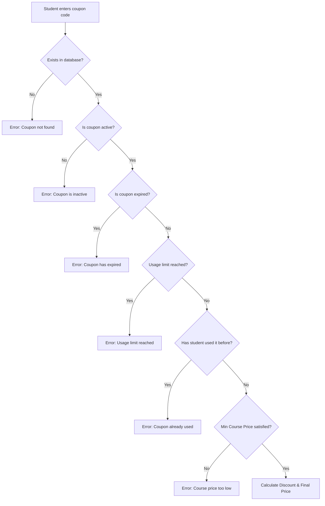

# Promotion & Coupon Code System Design

This document details the architecture, design decisions, and security properties of the newly implemented Coupon Code System in **VeoLMS**.

---

## 1. System Overview

The coupon code system allows administrators to create promotional campaigns that apply either percent-based or fixed discount deductions during course purchases.

### Visual Aesthetic (Vercel-Inspired UI)
- **High-Contrast Typography**: Uses mono-spaced styles (`font-mono tracking-wider`) for code strings (`WELCOME100`) to emphasize distinct promo tokens.
- **Sleek Table Layout**: Clean layout lines, responsive tables, and visual gauges showing usage progression (e.g. `24 / 100` uses).
- **Status badging**: Vibrant state badges (`Active`, `Inactive`, `Expired`, `Limit Reached`) using minimal background fills and saturated text colors.
- **Transactional Details**: The student price card dynamically updates showing strike-through original prices and custom green offset totals (`-₹299.00`). Paid invoices render detailed receipts showing exact discount amounts and applied codes.

---

## 2. Technical Architecture

### 2.1 Database Models

#### A. Coupon Schema (`backend/src/models/Coupon.ts`)
Stores the properties, rules, constraints, and metrics of each promo:
- `code` (String, unique, uppercase, trimmed): The token string used for activation.
- `discountType` (`'percentage' | 'fixed'`): Calculation model.
- `discountValue` (Number): Value of the deduction (percentage multiplier or absolute cash).
- `maxDiscountAmount` (Number, optional): Upper cap for percent-based discounts.
- `minCoursePrice` (Number, default 0): Lower boundary for course cost.
- `expiryDate` (Date, optional): Date after which the code becomes invalid.
- `isActive` (Boolean, default true): Administrative switch to turn campaigns on/off instantly.
- `usageLimit` (Number, optional): Absolute redemptions cap.
- `usedCount` (Number, default 0): Current successful redemptions metric.
- `createdBy` (ObjectId ref User): Audit tracking of the creator.

#### B. Enrollment Schema (`backend/src/models/Enrollment.ts` updates)
Enables payment ledgers to store historical invoice receipts:
- `couponCode` (String, optional): Identifies which code was applied.
- `discountAmount` (Number, default 0): The currency deduction amount.
- `originalPrice` (Number): Catalog price at purchase.
- `paidPrice` (Number): Actual price paid by the user.
- `razorpayOrderId` (String, sparse index): Made optional to handle free checkouts (100% discounts) that bypass the payment processor entirely.

---

## 3. Robust Business Logic

To prevent double-spend, reuse exploits, or rounding errors, the validation engine follows these strict sequential checks:



### Calculations & Sanitization
1. **Percentage Discounts**:
   $$\text{discount} = \min\left(\frac{\text{price} \times \text{value}}{100}, \text{maxDiscountAmount}\right)$$
2. **Fixed Discounts**:
   $$\text{discount} = \text{value}$$
3. **Rounding**:
   Both the discount amount and final price are rounded to two decimal places (`Math.round(val * 100) / 100`) to eliminate IEEE 754 floating-point inaccuracies.
4. **Range Enforcement**:
   $$\text{discount} = \min(\max(\text{discount}, 0), \text{price})$$
   $$\text{finalPrice} = \max(\text{price} - \text{discount}, 0)$$
   This guarantees that courses can never have a negative price or a discount exceeding their cost.

---

## 4. Security Framework & Vulnerability Controls

### 4.1 Server-Side Computations
All pricing, validation, and database operations are executed exclusively on the server. The client is treated as untrusted.
* When checking out, the frontend simply sends `{ courseId, couponCode }`.
* The server fetches the course price directly from MongoDB, verifies and applies the coupon rules, and issues the exact payment order amount.
* This blocks tamper attempts (e.g., modifying the price parameters in browser network requests).

### 4.2 Checkout Flow & Transactional Integrity
We handle checkout depending on the calculated final price:

#### Case A: Discounted Price is 0 (100% Free Checkout)
Razorpay does not support zero-amount transactions (minimum charge is ₹1.00). If the final price is 0:
1. The server creates a completed enrollment immediately with `'paid'` status and `enrolledAt` set.
2. It increments the coupon `usedCount` atomically in the database:
   ```typescript
   await Coupon.updateOne({ code: coupon.code }, { $inc: { usedCount: 1 } });
   ```
3. It sends a response `{ success: true, free: true, enrollment }`.
4. The client receives this and redirects the student to their dashboard instantly, avoiding unnecessary payment gateway load.

#### Case B: Discounted Price is > 0
1. The server generates a standard Razorpay Order using the discounted price.
2. It creates a pending enrollment with `'pending'` status.
3. The student completes payment in the gateway.
4. When verification runs (via user endpoint or webhook), the system updates the status:
   ```typescript
   const enrollment = await Enrollment.findOneAndUpdate(
     { razorpayOrderId, paymentStatus: 'pending' },
     { paymentStatus: 'paid', razorpayPaymentId, enrolledAt: new Date() },
     { new: true }
   );
   ```
5. **Atomic Redemptions count**: The coupon `usedCount` is incremented *only* if the enrollment transitions from `pending` to `paid` successfully. This guarantees that abandoned checkouts do not exhaust the coupon usage limits.
6. **Thread-Safe Re-entrancy Block**: Using the filter `{ paymentStatus: 'pending' }` ensures that if a webhook and verification call run concurrently, only one of them succeeds in modifying the status and incrementing the count, preventing double-redemption tallies.

### 4.3 Administrator Controls
All CRUD actions are strictly guarded by middleware:
```typescript
router.use(authenticate, authorize('admin'));
```
Only authenticated users with the role `'admin'` can create, edit, toggle, or delete coupon promotions.
